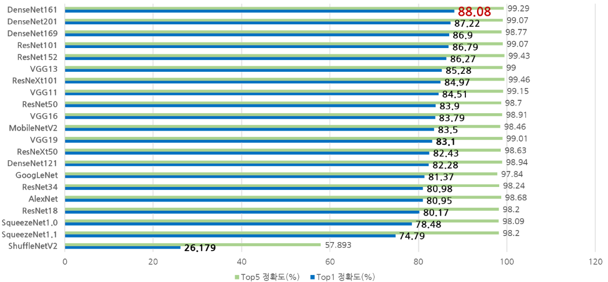
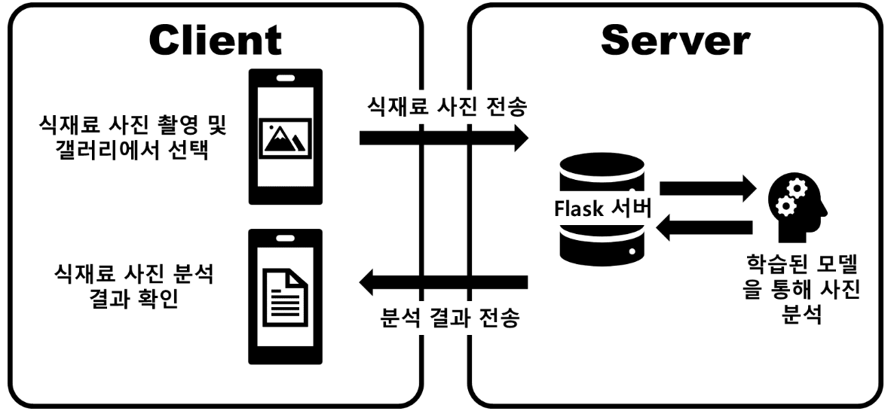
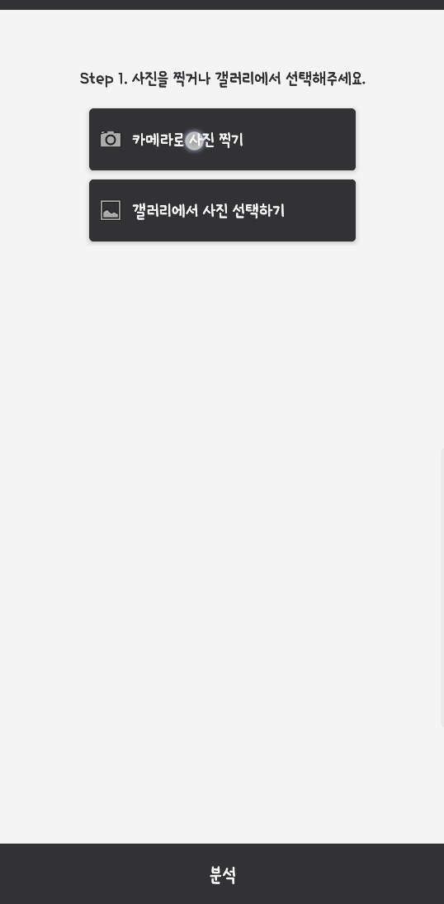
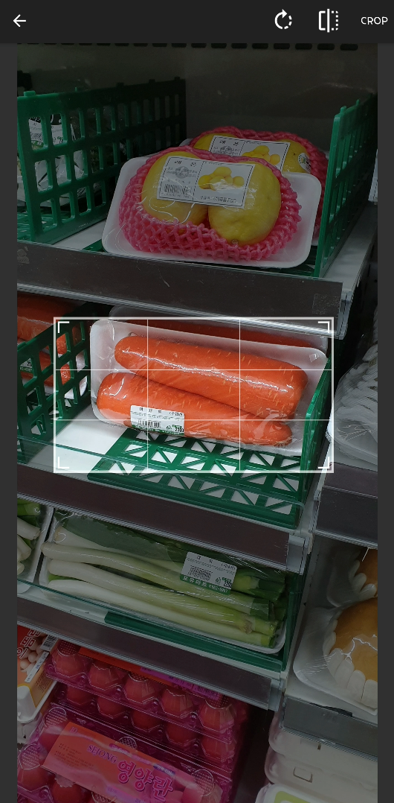
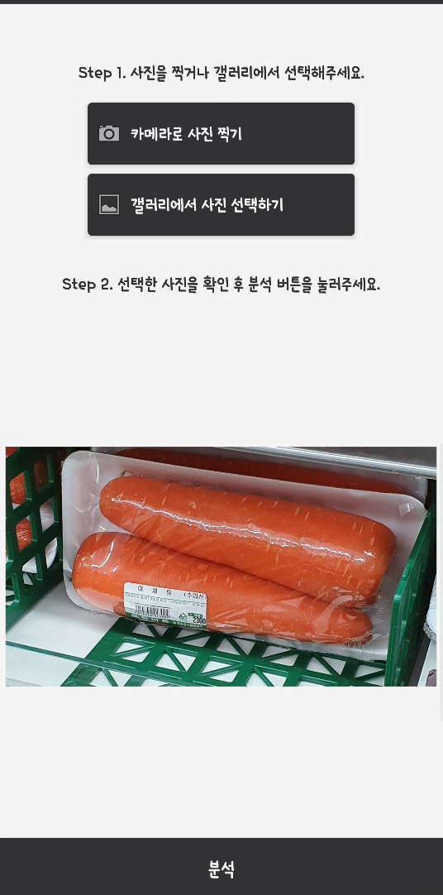
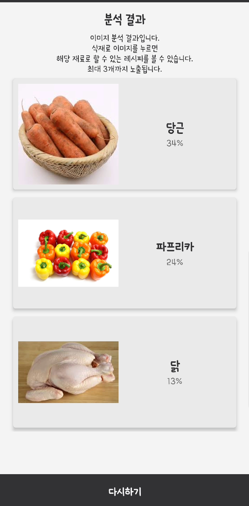
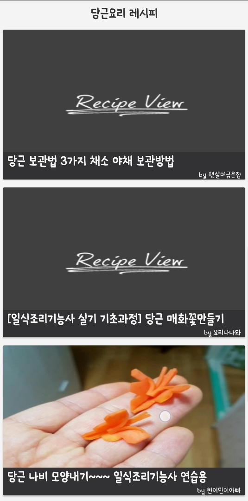

# 식재료 인식 레시피 어플리케이션

## 개요
식재료 사진 인식을 이용한 요리 레시피 어플리케이션입니다. 식재료 인식에는 인공지능 기술 중 하나인 Convolutional Neural Network(CNN) 기술을 사용하였습니다. 여러가지 CNN 모델들을 테스트해봤고, 그 중에서 가장 성능이 좋았던 DenseNet 161 모델을 선택하게 되었습니다. 카테고리는 가장 레시피 수가 많은 식재료 중 30가지를 선별하여 정하였고, 카테고리별로 이미지를 최소 64장 ~ 최대 522장까지 수집하여 학습을 진행하였습니다. 그리고 안드로이드 어플리케이션을 제작하고 이미지를 분석하는 서버를 구성하는 작업을 했습니다.

## 학습
학습은 CNN 모델을 사용했습니다. 프레임워크는 Pytorch를 사용했는데, 개인적으로 Tensorflow보다 코드 작성이 편해서 선택했습니다. 그리고 데이터의 수가 적기 때문에 Pre-trained 모델을 사용한 Transfer learning이 필요하다고 생각되어서 Pythorch에서 제공하는 pre-trained 모델을 사용하기로 결정했습니다. pythorch에서는 AlexNet부터 시작해서 ResNet, DenseNet 등 유명한 CNN 모델들을 제공하고 있었습니다. 그 중에서 제 데이터셋을 이용해서 학습을 했을 때, 결과가 좋은 모델을 찾기 위해 모델별로 테스트를 진행하였습니다.

| 하드웨어 환경 | 소프트웨어 환경 |
| --- | --- |
| OS : Ubuntu 18.04.02 LTS  CPU : Intel i5-6500 3.2GHz 2 Core 4 Threads  GPU : GTX 1060 6GB Pascal, 1280 CUDA Core, 8Gbps(Memory Speed), Compute Capability 6.1   Memory : 16GB, 2133MHz  저장장치 : SSD | Python: 3.7.4  CUDA 버전 : 10.0.130   cuDNN 버전 : 7.6.2    딥러닝 프레임워크 : PyTorch 1.2.0 |

<테이블 1. 학습에 사용된 컴퓨터의 환경 세팅>

### 테스트
테스트는 테이블1에 나와있는 환경으로 구성을 해서 진행하였습니다. Pytorch에서는 torchvision.models 라이브러리를 통해 다양한 pre-trained 모델을 제공합니다. 그 중에서 Classification을 위해 pre-training 된 모델을 사용했습니다. 테스트에 사용된 모델은 AlexNet, VGG, ResNet, SqueezeNet, DenseNet, Inception, GoogLeNet, ShuffleNet V2, MobileNet V2, ResNeXt입니다. 
Batch Size는 128, Epochs는 100으로 설정하고 모든 모델을 5번씩 학습하였고, 5번의 평균을 낸 정확도 값을 이용하였습니다. 단 Validation Loss 값이 최소값에 도달한 후 10회 동안 최소값을 갱신하지 않으면 학습이 중지되도록 설정하였습니다. 재 학습하는 레이어는 분류기능을 담당하는 Fully-Connected Layer만 재 학습되도록 설정하였고, 이미지의 특징을 뽑아내는 Convolution Layer는 건드리지 않았습니다.
데이터셋을 다양하게 하기 위해 Data Augmentation을 적용하였습니다. 종류는 랜덤 크기 조절 후 자르기, 랜덤 회전, 랜덤 좌우 뒤집기, 중심에서 자르기를 적용하였습니다. 손실함수는 Cross Entropy를 사용하였고, 최적화 함수는 SGD(learning rate = 0.01, Momentum = 0.9, Weight decay = 0)으로 설정하였고, 학습률 감소는 적용하지 않았습니다.

### 데이터셋 구성

카테고리는 레시피 사이트(만개의 레시피)에서 가장 레시피 수가 많은 식재료들 위주로 30개를 선정하였습니다. 그리고 구글 이미지에서 데이터를 수집하였고, 정리를 통해 각 카테고리 별로 최소 64 ~ 최대 522장, 총 6418장의 이미지를 구하였습니다. 그리고 카테고리별로 훈련 : 검증 : 테스트 이미지 수의 비율을 7:2:1로 정하여 나눴습니다. 이 비율은 일반적으로 데이터셋을 구성할 때 많이 사용되는 비율입니다. 자세한 구성은 테이블 2에 나와있습니다.

## 학습결과

각 모델을 테스트한 결과 DenseNet 161이 Top-1 정확도가 88.08%로 가장 높게 나왔습니다. Top-5 정확도는 거의 모든 모델이 98% 이상의 정확도가 나와서 큰 의미가 없어서 Top-1 정확도가 가장 높은 DenseNet 161로 학습을 진행한 모델을 이용하기로 결정하였습니다. Top-5 정확도가 상당히 높게 나온 이유는, 식재료의 특성이 서로 너무 뚜렷했기 때문이라고 생각합니다. 하지만 쪽파와 부추처럼 굉장히 비슷한 특성을 가진 식재료들은 정확도가 낮게 나왔습니다. 모델 별 정확도를 비교한 차트는 그림1에 나와있습니다.

| 카테고리 |     | 훈련 이미지 수 | 검증 이미지 수 | 테스트 이미지 수 |
| --- | --- | --- | --- | --- |
| 멸치  | 001.anchovy | 220 | 63  | 31  |
| 사과  | 002.apple | 242 | 69  | 34  |
| 소고기 | 003.beef | 152 | 44  | 22  |
| 당근  | 004.carrot | 206 | 58  | 29  |
| 닭고기 | 005.chicken | 58  | 17  | 8   |
| 고추  | 006.chili | 249 | 71  | 36  |
| 부추  | 007.chives | 108 | 30  | 15  |
| 꼬막  | 008.cockle | 98  | 28  | 14  |
| 오이  | 009.cucumber | 158 | 45  | 22  |
| 무   | 010.daikon | 81  | 23  | 11  |
| 계란  | 011.egg | 119 | 33  | 16  |
| 가지  | 012.eggplant | 46  | 12  | 6   |
| 마늘  | 013.garlic | 364 | 104 | 53  |
| 대파  | 014.greenonion | 308 | 88  | 44  |
| 애호박 | 015.greenpumpkin | 136 | 38  | 19  |
| 다시마 | 016.kelp | 95  | 26  | 13  |
| 새송이버섯 | 017.kingoystermushroom | 175 | 50  | 25  |
| 김   | 018.laver | 59  | 17  | 8   |
| 양파  | 019.onion | 227 | 65  | 32  |
| 굴   | 020.oyster | 152 | 42  | 22  |
| 파프리카 | 021.paprika | 298 | 85  | 43  |
| 깻잎  | 022.perillaleaf | 82  | 23  | 11  |
| 돼지고기 | 023.pork | 202 | 58  | 29  |
| 감자  | 024.potato | 110 | 32  | 16  |
| 메추리알 | 025.quailegg | 150 | 42  | 21  |
| 표고버섯 | 026.shiitake | 215 | 61  | 30  |
| 새우  | 027.shrimp | 119 | 34  | 17  |
| 쪽파  | 028.smallgreenonion | 216 | 62  | 31  |
| 시금치 | 029.spinach | 122 | 35  | 17  |
| 오징어 | 030.squid | 85  | 24  | 12  |

 

<테이블 2. 데이터세트 구성>

<그림1. 모델 별 정확도 비교 – 5회 측정 평균값, 배치크기 128>

 

<그림2. 클라이언트-서버의 간략한 구조>

## 어플리케이션

학습한 모델을 이용하기 위한 어플리케이션을 제작했습니다. 안드로이드 기반으로 제작했으며 간단하게 카메라로 사진을 찍는 것과, 찍혀진 사진을 갤러리에서 불러오는 기능, 그리고 이 사진을 서버로 전송하여 분석 결과를 받는 기능, 분석된 결과를 이용하여 해당 식재료의 레시피 데이터를 크롤링 해오는 기능을 적용했습니다.
사용자에게 넘겨 받은 데이터를 분석하기 위한 분석 서버는 Flask 웹 프레임워크를 사용했습니다. 그 이유는 학습 모델 자체가 Python 언어로 만들어져 있기 때문에 Flask라는 Python기반의 프레임워크를 이용하면 호환성이 좋기 때문입니다. 분석 서버는 간단하게 사용자로부터 이미지를 전송 받으면 학습 모델을 이용해 분석하고, 분석 결과를 다시 사용자에게 JSON 형식으로 돌려주도록 만들었습니다. 이 때 Top3 정보만 전달하도록 설정했습니다. 
분석결과 액티비티에서 사용자가 해당 식재료를 누르게 되면, 만개의 레시피 사이트에서 해당 식재료로 할 수 있는 요리 레시피 목록을 크롤링해오도록 구성하였습니다. 그리고 레시피를 누르면 해당 레시피 페이지로 연결되도록 만들었습니다. 하단에서 실제 어플리케이션 동작 화면을 볼 수 있습니다.

## 사용기술
- Flask
- Android
- Retrofit2
- PyTorch
- Convolutional Neural Network

## 영상

위의 이미지를 클릭하시면 영상을 보실 수 있습니다.

## 스크린샷 및 상세 설명

메인화면입니다.

카메라로 사진을 찍고 원하는 부분을 크롭할 수 있습니다.

분석 버튼을 누르면 서버에서 크롭한 이미지를 분석합니다.

분석 결과에 따른 식재료를 보여줍니다.

식재료를 클릭하면 레시피 데이터를 볼 수 있습니다.
